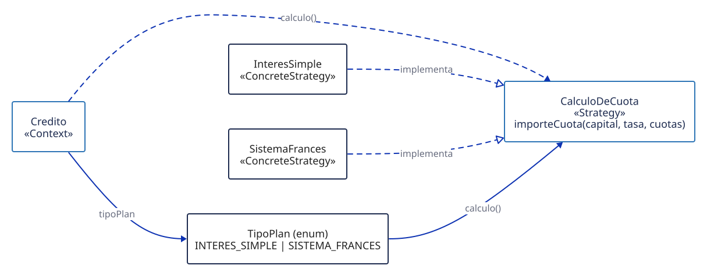
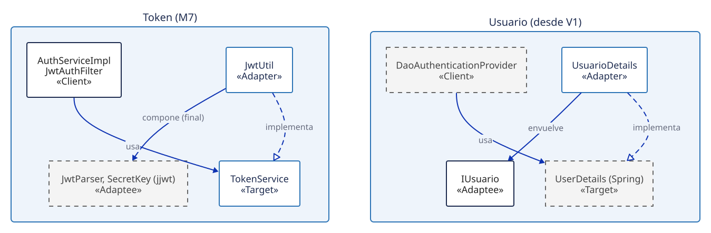
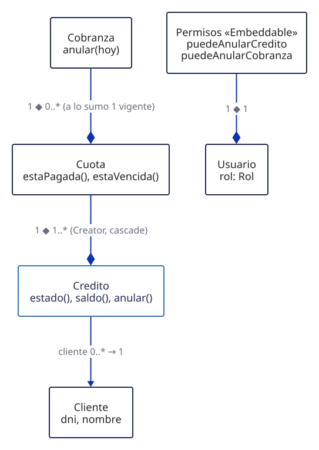
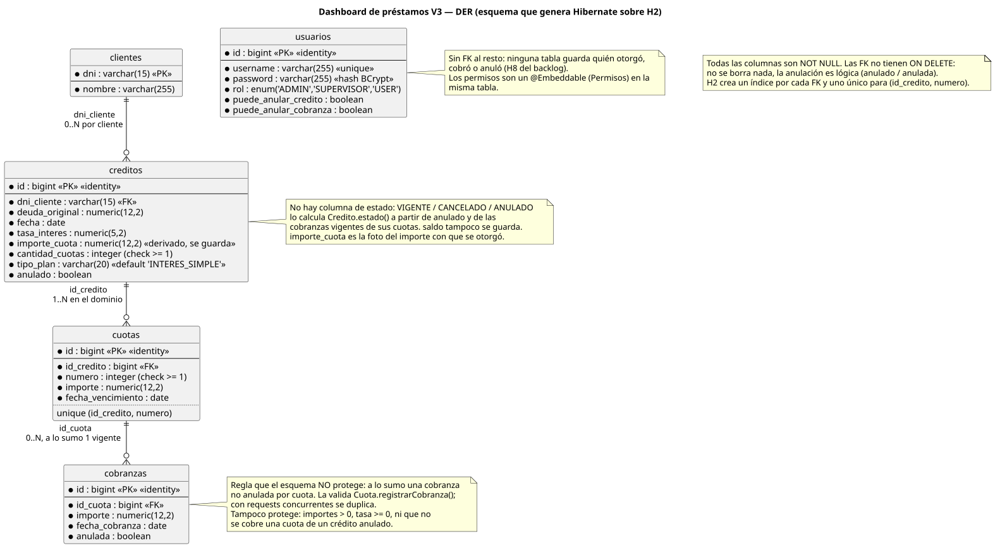

<div align="center">

# Dashboard de préstamos

Sistema interno de una financiera: clientes, créditos en cuotas, cobranzas, anulaciones y dashboard de supervisor.<br>
TPO de Proceso de Desarrollo de Software, UADE 2C 2026, grupo 7. Iteración 3: MVC + patrones.


[Reporte](docs/reporte/reporte-v3.html) · [Manual](docs/manual/index.html) · [Casos de uso](docs/casos-de-uso/README.md) · [Lista de mejoras](docs/entrega/lista-mejoras.md) · [Swagger](http://localhost:8080/swagger-ui.html)

</div>

## Índice

- [Qué es](#qué-es)
- [Iteración 3: Strategy y Adapter](#iteración-3-strategy-y-adapter)
- [Mejoras](#mejoras)
- [Modelo de dominio y DER](#modelo-de-dominio-y-der)
- [Cómo levantarlo](#cómo-levantarlo)
- [Cómo se verifica](#cómo-se-verifica)
- [Documentación](#documentación)
- [Historia V0 → V3](#historia-v0--v3)
- [Equipo](#equipo)

## Qué es

Un operador da de alta clientes, les otorga créditos (interés simple o sistema francés) y registra el cobro de cada cuota; un supervisor puede anular créditos y cobranzas y ve el dashboard con lo financiado, lo cobrado y la mora; el admin gestiona roles y permisos.

- **Backend**: [Spring Boot](https://spring.io/projects/spring-boot) (framework Java para APIs REST) con Spring Security + JWT (token firmado que identifica al usuario en cada request), JPA (mapeo de objetos a tablas) y [H2](https://www.h2database.com) (base en memoria, se recrea al arrancar).
- **Frontend**: [React](https://react.dev) (librería de interfaces) con [Redux Toolkit](https://redux-toolkit.js.org) (estado global de la app) y [Vite](https://vite.dev) (servidor de desarrollo y build).

Panorama MVC: la vista (React) llama a los controladores REST, que delegan en los servicios; las reglas de negocio viven en el modelo.


## Iteración 3: Strategy y Adapter

**Strategy (M9).** El cálculo de la cuota es intercambiable: [`CalculoDeCuota`](backend/src/main/java/com/uade/tpejemplo/model/interfaces/CalculoDeCuota.java) es la estrategia, [`InteresSimple`](backend/src/main/java/com/uade/tpejemplo/model/plan/InteresSimple.java) y [`SistemaFrances`](backend/src/main/java/com/uade/tpejemplo/model/plan/SistemaFrances.java) las concretas, [`TipoPlan`](backend/src/main/java/com/uade/tpejemplo/model/TipoPlan.java) elige cuál y [`Credito`](backend/src/main/java/com/uade/tpejemplo/model/Credito.java) es el contexto. Agregar un plan nuevo no toca `Credito` (OCP).



**Adapter (M7, O2).** [`TokenService`](backend/src/main/java/com/uade/tpejemplo/service/TokenService.java) es el Target que usan [`JwtAuthFilter`](backend/src/main/java/com/uade/tpejemplo/security/JwtAuthFilter.java) y [`AuthServiceImpl`](backend/src/main/java/com/uade/tpejemplo/service/impl/AuthServiceImpl.java); [`JwtUtil`](backend/src/main/java/com/uade/tpejemplo/security/JwtUtil.java) lo adapta a jjwt (librería externa) y traduce sus excepciones. [`UsuarioDetails`](backend/src/main/java/com/uade/tpejemplo/security/UsuarioDetails.java) adapta `IUsuario` al `UserDetails` de Spring Security.



## Mejoras

Detalle completo, con clase y método de cada una: [lista de mejoras](docs/entrega/lista-mejoras.md). Rutas Java bajo [`backend/src/main/java/com/uade/tpejemplo/`](backend/src/main/java/com/uade/tpejemplo/).

| ID | Qué | Patrón o concepto | Código |
|---|---|---|---|
| M9 | Cuota con interés simple o sistema francés | Strategy | [`CalculoDeCuota`](backend/src/main/java/com/uade/tpejemplo/model/interfaces/CalculoDeCuota.java) |
| M7 | JWT detrás de un Target propio | Adapter | [`JwtUtil`](backend/src/main/java/com/uade/tpejemplo/security/JwtUtil.java) |
| M1 | No se cobra una cuota de un crédito anulado (TPO-004) | Information Expert | [`Cuota`](backend/src/main/java/com/uade/tpejemplo/model/Cuota.java) |
| M3 | Dashboard solo con lo vigente (TPO-003) | Corrección + Expert | [`DashboardServiceImpl`](backend/src/main/java/com/uade/tpejemplo/service/impl/DashboardServiceImpl.java) |
| M4 | Permisos de anulación validados en el backend (TPO-007) | MVC + Expert | [`CreditoServiceImpl`](backend/src/main/java/com/uade/tpejemplo/service/impl/CreditoServiceImpl.java) |
| M5 | Respuestas 401/403/404/405 (TPO-001, TPO-002) | MVC | [`GlobalExceptionHandler`](backend/src/main/java/com/uade/tpejemplo/exception/GlobalExceptionHandler.java) |
| M8 | Estado, saldo y anulación en el agregado `Credito` | Expert + Creator | [`EstadoCredito`](backend/src/main/java/com/uade/tpejemplo/model/EstadoCredito.java) |

<details>
<summary>El resto</summary>

| ID | Qué | Patrón o concepto | Código |
|---|---|---|---|
| M2 | "Tiene cobranzas" ignora las anuladas | Information Expert | [`Credito`](backend/src/main/java/com/uade/tpejemplo/model/Credito.java) |
| M6 | Cuota vencida (mora) | Information Expert | [`Cuota`](backend/src/main/java/com/uade/tpejemplo/model/Cuota.java) |
| M10 | Dashboard también para ADMIN (TPO-010) | Control de acceso | [`SecurityConfig`](backend/src/main/java/com/uade/tpejemplo/config/SecurityConfig.java) |
| API | Swagger, 401 sin token, `@Valid`, `GET /api/creditos` | MVC | [`OpenApiConfig`](backend/src/main/java/com/uade/tpejemplo/config/OpenApiConfig.java) |
| O1 | La vista usa `puedeAnularse` del modelo | MVC + Expert | [`Creditos.jsx`](frontend/src/pages/Creditos.jsx) |
| O3 | El total sale de las cuotas emitidas | Strategy, Expert | [`Credito`](backend/src/main/java/com/uade/tpejemplo/model/Credito.java) |
| O5 | La guarda del ADMIN vive en el modelo | MVC + Expert | [`Usuario`](backend/src/main/java/com/uade/tpejemplo/model/Usuario.java) |
| O6 | El crédito nace con su plan de cuotas | Creator | [`Credito`](backend/src/main/java/com/uade/tpejemplo/model/Credito.java) |
| O7 | Saldo pendiente y monto vencido en el dashboard | Expert | [`DashboardStatsResponse`](backend/src/main/java/com/uade/tpejemplo/dto/response/DashboardStatsResponse.java) |
| H1 | Anular una cobranza ya anulada da 400 | Information Expert | [`Cobranza`](backend/src/main/java/com/uade/tpejemplo/model/Cobranza.java) |
| F1, F2 | 403 sin el rol; 400 ante body mal formado | MVC | [`GlobalExceptionHandler`](backend/src/main/java/com/uade/tpejemplo/exception/GlobalExceptionHandler.java) |
| R3 | `GET /api/auth/me` y refresco de permisos | MVC + Expert | [`AuthController`](backend/src/main/java/com/uade/tpejemplo/controller/AuthController.java) |
| S1-S5 | Transacciones, open-in-view, secreto JWT por env, 500 sin filtrar, auth provider de Spring | Prácticas de Spring | [`application.properties`](backend/src/main/resources/application.properties) |
| D, BS, DF | Código muerto, duplicado y de depuración | Bad smells | [lista](docs/entrega/lista-mejoras.md) |
| UI, DT | Formato es-AR, estados, dark theme | Vista | [`index.css`](frontend/src/index.css) |
| T-1, T-5 | Tests de códigos HTTP y de fechas sin reloj | Tests | [`CodigosHttpTest`](backend/src/test/java/com/uade/tpejemplo/controller/CodigosHttpTest.java) |

</details>

## Modelo de dominio y DER



- Diagrama de clases entregable: [`clases-v3.puml`](docs/diagramas/clases-v3.puml) ([general](docs/diagramas/clases-v3-general.svg), [modelo](docs/diagramas/clases-v3-modelo.svg)).
- Ciclo de vida del crédito: [`credito-estados.svg`](docs/diagramas/archify/credito-estados.svg); secuencia de anular: [`anular-credito.svg`](docs/diagramas/archify/anular-credito.svg).
- DER: [`der-v3.puml`](docs/diagramas/der-v3.puml) · [SVG](docs/diagramas/der-v3.svg) · [PNG](docs/diagramas/der-v3.png).



## Cómo levantarlo

Requiere JDK 21, [Maven](https://maven.apache.org) (build y dependencias de Java) y [Node](https://nodejs.org) (para el front).

```bash
cd backend && mvn spring-boot:run              # http://localhost:8080, perfil dev
cd frontend && npm install && npm run dev      # http://localhost:5173, proxy /api → :8080
```

Perfil prod: `--spring.profiles.active=prod` (sin consola H2 ni usuarios semilla; exige `CORS_ORIGIN` y `JWT_SECRET`; sigue con H2 en memoria). Ver [`application.properties`](backend/src/main/resources/application.properties).

<details>
<summary>Usuarios de prueba</summary>

Password = usuario. Los crea [`DataInitializer`](backend/src/main/java/com/uade/tpejemplo/config/DataInitializer.java), solo en dev.

| Usuario | Rol |
|---|---|
| `admin` | ADMIN: roles y permisos |
| `supervisor` | SUPERVISOR, con todos los permisos |
| `user` | USER, sin permisos de anulación |

</details>

- **Swagger** (documentación interactiva de la API): <http://localhost:8080/swagger-ui.html>. Botón Authorize: pegar el token de `/api/auth/login`.
- **Consola H2** (solo perfil dev): <http://localhost:8080/h2-console>, JDBC URL `jdbc:h2:mem:tpdb`, usuario `sa`, sin password.
- **Demo guiada**: `bash docs/demo.sh` abre nvim con cada cambio V2 vs V3 en diff ([cómo usarla](docs/demo.md)).

## Cómo se verifica

`cd backend && mvn test`: **40 tests, 0 fallas** ([JUnit 5](https://junit.org/junit5/), framework de tests de Java).

| Test | Cantidad | Qué cubre |
|---|---|---|
| [`CreditoTest`](backend/src/test/java/com/uade/tpejemplo/model/CreditoTest.java), [`CuotaTest`](backend/src/test/java/com/uade/tpejemplo/model/CuotaTest.java), [`CobranzaTest`](backend/src/test/java/com/uade/tpejemplo/model/CobranzaTest.java) | 19 | Reglas del dominio |
| [`InteresSimpleTest`](backend/src/test/java/com/uade/tpejemplo/model/plan/InteresSimpleTest.java), [`SistemaFrancesTest`](backend/src/test/java/com/uade/tpejemplo/model/plan/SistemaFrancesTest.java) | 8 | Estrategias de cuota |
| [`CodigosHttpTest`](backend/src/test/java/com/uade/tpejemplo/controller/CodigosHttpTest.java) | 10 | 400/401/403/404/405/406/415 con JWT real |
| [`CobranzaConcurrenteTest`](backend/src/test/java/com/uade/tpejemplo/service/CobranzaConcurrenteTest.java) | 1 | Cobro concurrente de la misma cuota |
| [`AnulacionConcurrenteTest`](backend/src/test/java/com/uade/tpejemplo/service/AnulacionConcurrenteTest.java) | 1 | Anular y cobrar el mismo crédito en paralelo |
| [`TpEjemploApplicationTests`](backend/src/test/java/com/uade/tpejemplo/TpEjemploApplicationTests.java) | 1 | Arranca el contexto de Spring |

Además: [`verificar-cu.sh`](docs/casos-de-uso/verificar-cu.sh) (casos de uso contra la API). El resto de la evidencia está en [Evidencia de verificación](#evidencia-de-verificación-solo-en-el-repo-de-github).

## Documentación

| Documento | Para qué | Link |
|---|---|---|
| Reporte de la iteración 3 | Cada mejora: patrón, problema, solución y por qué | [HTML](docs/reporte/reporte-v3.html). Verlo renderizado: GitHub Pages (pendiente de activar) |
| Manual | Cómo usar y levantar el sistema | [HTML](docs/manual/index.html). Verlo renderizado: GitHub Pages (pendiente de activar) |
| Lista de mejoras | Todas las mejoras con clase y método | [lista-mejoras.md](docs/entrega/lista-mejoras.md) |
| Casos de uso | Fichas, diagrama y trazabilidad desde V0 | [README](docs/casos-de-uso/README.md) · [diagrama](docs/casos-de-uso/casos-de-uso-v3.svg) |
| Diagramas | Clases, DER, Strategy, Adapter, MVC | [`docs/diagramas/`](docs/diagramas/) |
| Backlog | Lo que queda pendiente para las próximas iteraciones | [backlog.md](docs/backlog.md) |

### Evidencia de verificación (solo en el repo de GitHub)

`docs/trabajo/` no entra al zip de entrega (`export-ignore`); estos archivos se leen en GitHub.

| Documento | Para qué | Link |
|---|---|---|
| API | Mapa de endpoints | [api.md](docs/trabajo/api.md) |
| Guía de lectura | Por dónde empezar a leer V3 (~45 min) | [guia-de-lectura.md](docs/trabajo/guia-de-lectura.md) |
| Smoke de la API | Verificación con curl | [smoke.md](docs/trabajo/smoke.md) |
| Verificación visual | Recorrido del front | [visual.md](docs/trabajo/visual.md) |
| Recorrido de casos de uso | Casos de uso contra el sistema | [recorrido-cu.md](docs/trabajo/recorrido-cu.md) |
| Notas de trabajo | Revisiones, tests y detalle de cada mejora | [`docs/trabajo/`](docs/trabajo/) |

## Historia V0 → V3

- **V0**: proyecto inicial, Spring Boot + React con el dominio de préstamos.
- **V1**: iteración 1, bad smells (entregada 08/09).
- **V2**: iteración 2, GRASP e interfaces de servicio restituidas.
- **V3**: iteración 3, MVC + Strategy y Adapter (entrega 13/10). El cambio respecto de V2 se ve con `git diff v2..main`.

## Equipo

Grupo 7: Andrei Veis ([@andreiveisuade](https://github.com/andreiveisuade)) y Regulo Luna ([@Regulo-Luna](https://github.com/Regulo-Luna)).
