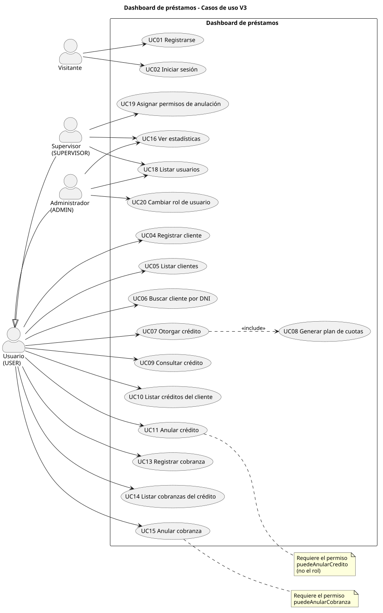

# Casos de uso V3 y trazabilidad

Casos de uso del dashboard de préstamos tal como funcionan en V3 (main), con la numeración de V0 (`docs-v0/docs/03-casos-de-uso.puml`) para poder seguir cada uno desde el punto 0. Cada ficha dice qué hace el actor, qué responde el sistema (con el código HTTP real), qué regla de negocio se aplica y dónde, y con qué se verificó.

Convenciones:

- Rutas del backend relativas a `backend/src/main/java/com/uade/tpejemplo/`; tests relativos a `backend/src/test/java/com/uade/tpejemplo/`; front relativo a `frontend/src/`. `archivo:línea` apunta al método.
- **Verificación**: *Test* = test automático (`mvn test`, 36 tests, todos pasan al 2026-10-06): de dominio en `model/` y `model/plan/`, y de códigos HTTP en `controller/CodigosHttpTest` (`@WebMvcTest` con la seguridad JWT real). *Smoke* = smoke test manual del equipo. *Final* = verificación final manual del equipo, con capturas. Smoke y Final son notas de trabajo internas que no van en la entrega. *API* = `verificar-cu.sh` de esta carpeta, corrido sobre una base limpia (resultados en la sección 6).
- Errores: todos salen por `exception/GlobalExceptionHandler.java` con cuerpo `{status, error, mensajes[]}`: 400 regla de negocio (`handleBusiness`:32), 400 validación del DTO (`handleValidation`:37), 400 body o parámetro mal formado (`handleRequestInvalida`:45), 401 credenciales (`handleAuth`:50), 403 sin permiso (`handleDenied`:55), 404 no encontrado (`handleNotFound`:27). Sin token, o con token inválido, la cadena de seguridad responde 401 sin cuerpo; con token y sin el rol, 403 sin cuerpo (`config/SecurityConfig.java:56-57`). Los dos casos y el 400/404/405 los cubre `controller/CodigosHttpTest`.

## 1. Actores

| Actor | Quién es en el sistema | Qué lo define |
|---|---|---|
| Visitante | Persona sin sesión | Solo `/api/auth/**` es público, salvo `/api/auth/me` que pide token (`config/SecurityConfig.java:47-48`) |
| Usuario (USER) | Operador de créditos y cobranzas. Semilla `user`/`user`, sin permisos de anulación | `anyRequest().authenticated()` (`config/SecurityConfig.java:53`); semilla en `config/DataInitializer.java:27` |
| Supervisor (SUPERVISOR) | Es un Usuario que además ve el dashboard y reparte los permisos de anulación. Semilla `supervisor`/`supervisor`, con los dos permisos | `/api/supervisor/**` y `/api/dashboard/**` (`config/SecurityConfig.java:51-52`); `config/DataInitializer.java:26` |
| Administrador (ADMIN) | Es un Usuario que además ve el dashboard y cambia roles. Semilla `admin`/`admin`, con los dos permisos | `/api/admin/**` y `/api/dashboard/**` (`config/SecurityConfig.java:50,52`); `config/DataInitializer.java:25` |

Dos aclaraciones que cambian respecto de V0 y de los diagramas de la clase 3:

- **Anular no depende del rol sino del permiso.** UC11 y UC15 los puede ejecutar cualquier Usuario que tenga `puedeAnularCredito` / `puedeAnularCobranza` (lo valida el backend desde M4). Por eso en el diagrama los dos cuelgan de Usuario, con una nota, y no de Supervisor.
- **El cliente del préstamo no es actor**: no tiene usuario ni interactúa con el sistema. Es un dato (`model/Cliente.java`).

## 2. Diagrama

Fuente: `casos-de-uso-v3.puml` (renderizado con `plantuml -tsvg` y `-tpng`). Supervisor y Administrador heredan de Usuario: todo lo que hace un USER lo pueden hacer ellos.

## 3. Fichas de los casos de uso vigentes

### UC01 Registrarse

- **Actor**: Visitante. **RF V0**: RF-AU-01, RF-AU-03.
- **Precondición**: ninguna.
- **Flujo principal**: 1. El visitante carga usuario y contraseña en la pantalla de registro. 2. El sistema valida los campos. 3. Verifica que el usuario no exista. 4. Crea el usuario con rol USER y sin permisos de anulación. 5. Emite el token y responde **201** con token, rol y permisos. 6. El front guarda la sesión y navega a `/clientes`.
- **Errores**: usuario repetido → **400** "El usuario 'x' ya existe". Usuario vacío o contraseña de menos de 6 caracteres → **400** de validación (`dto/request/RegisterRequest.java`).
- **Postcondición**: existe un USER con `Permisos.ninguno()` y tiene sesión iniciada.
- **Reglas**: unicidad del username y rol fijo USER en `service/impl/AuthServiceImpl.java:33` `registrar`; alta solo por `model/Usuario.java:43` `nuevo`. Nadie puede registrarse como SUPERVISOR o ADMIN.
- **Endpoint**: `POST /api/auth/register` → `controller/AuthController.java:35` `register`.
- **Pantalla**: `pages/Register.jsx` (`/register`).
- **Verificación**: API (UC01 x3). Sin test unitario.

### UC02 Iniciar sesión

- **Actor**: Visitante. **RF V0**: RF-AU-02, RF-AU-03. Absorbe a UC03 "Emitir token JWT" (ver sección 4).
- **Precondición**: el usuario existe.
- **Flujo principal**: 1. Carga usuario y contraseña. 2. El sistema autentica contra la contraseña hasheada (BCrypt: `AuthenticationManager` de Spring con el `passwordEncoder` de `config/SecurityConfig.java:69`). 3. Emite un token JWT de 24 h (`service/TokenService.java`, adaptado por `security/JwtUtil.java`, M7). 4. Responde **200** con token, rol y permisos. 5. El front guarda token y usuario en `localStorage` y navega a `/clientes`.
- **Errores**: contraseña incorrecta o usuario inexistente → **401** "Bad credentials" (el mismo mensaje para los dos: no revela qué usuarios existen). Campos vacíos → **400** de validación.
- **Postcondición**: cada request siguiente lleva el token; `security/JwtAuthFilter.java:69` vuelve a cargar el usuario de la base en cada request, así que rol y permisos se leen siempre actualizados. El front los refresca con `GET /api/auth/me` (`controller/AuthController.java:53` `me`, `service/impl/AuthServiceImpl.java:63` `actual`) cada vez que se navega a una pantalla (`components/PrivateRoute.jsx`).
- **Reglas**: `service/impl/AuthServiceImpl.java:51` `login`.
- **Endpoint**: `POST /api/auth/login` → `controller/AuthController.java:44` `login`; `GET /api/auth/me` → `controller/AuthController.java:53` `me`.
- **Pantalla**: `pages/Login.jsx` (`/login`).
- **Verificación**: Smoke "Login con password incorrecta (M5)"; Final "Login", "Token basura / alterado / vencido", capturas `01-login.png`, `02-login-error.png`, `03-login-ok.png`; API (UC02 x4).
- **Evolución**: en V0-V2 la contraseña incorrecta daba 500 (TPO-001); V3 lo mapea a 401 (M5).

### UC04 Registrar cliente

- **Actor**: Usuario. **RF V0**: RF-CL-01.
- **Precondición**: sesión iniciada.
- **Flujo principal**: 1. El usuario carga DNI y nombre. 2. El sistema valida que no estén vacíos. 3. Verifica que no exista otro cliente con ese DNI. 4. Lo guarda y responde **201**. 5. El listado se actualiza.
- **Errores**: DNI repetido → **400** "Ya existe un cliente con DNI: x". DNI o nombre vacío, DNI de más de 15 caracteres o nombre de más de 255 → **400** de validación (`dto/request/ClienteRequest.java`, I-2). Sin sesión → **401**.
- **Postcondición**: el cliente existe y se le pueden otorgar créditos.
- **Reglas**: unicidad del DNI (es la clave primaria) en `service/impl/ClienteServiceImpl.java:25` `crear`; alta por `model/Cliente.java:30` `nuevo`.
- **Endpoint**: `POST /api/clientes` → `controller/ClienteController.java:32` `crear`.
- **Pantalla**: `pages/Clientes.jsx` (formulario).
- **Verificación**: Smoke "Crear cliente 111"; Final "Crear cliente"; API (UC04 x4); Test `controller/CodigosHttpTest.java:49` `dniDeMasDe15CaracteresDa400`, `:72` `sinTokenDa401`.
- **Hueco**: el DNI tiene largo máximo (15, I-2) pero no formato; `"abc"` se acepta con 201 (API). No hay modificación ni baja de clientes (A-09 de V0, ver P3).

### UC05 Listar clientes

- **Actor**: Usuario. **RF V0**: RF-CL-02.
- **Flujo principal**: 1. El usuario entra a Clientes. 2. El sistema devuelve todos los clientes (**200**). 3. La pantalla los muestra en una tabla.
- **Errores**: sin sesión → **401**.
- **Reglas**: `service/impl/ClienteServiceImpl.java:44` `listarTodos`. Sin paginación ni filtro.
- **Endpoint**: `GET /api/clientes` → `controller/ClienteController.java:49` `listarTodos`.
- **Pantalla**: `pages/Clientes.jsx` (tabla, se carga al entrar).
- **Verificación**: API (UC05). Sin test unitario.

### UC06 Buscar cliente por DNI

- **Actor**: Usuario. **RF V0**: RF-CL-03.
- **Flujo principal**: 1. Se pide un DNI. 2. El sistema devuelve el cliente (**200**).
- **Errores**: DNI inexistente → **404** "Cliente no encontrado con DNI: 'x'".
- **Reglas**: `service/impl/ClienteServiceImpl.java:36` `buscarPorDni`.
- **Endpoint**: `GET /api/clientes/{dni}` → `controller/ClienteController.java:41` `buscarPorDni`.
- **Pantalla**: `pages/Clientes.jsx` (bloque "Buscar cliente por DNI"): muestra nombre y DNI, o el 404 del back en el mismo bloque. Usa `api/clientes.js` `getCliente`.
- **Verificación**: API (UC06 x2); Test `controller/CodigosHttpTest.java:90` `clienteInexistenteDa404`; captura de la pantalla en la verificación del equipo.

### UC07 Otorgar crédito

- **Actor**: Usuario. **RF V0**: RF-CR-01. Incluye UC08.
- **Precondición**: el cliente existe.
- **Flujo principal**: 1. El usuario carga DNI del cliente, deuda original, fecha, tasa, cantidad de cuotas y tipo de plan (interés simple o sistema francés). 2. El sistema valida los datos. 3. Busca el cliente. 4. Crea el crédito: el importe de cuota lo calcula la estrategia del plan elegido (`model/Credito.java:80`, `model/TipoPlan.java:19` `calculo`, `model/plan/InteresSimple.java`, `model/plan/SistemaFrances.java`; M9 Strategy). 5. Genera el plan de cuotas (UC08). 6. Responde **201** con cuotas, total a devolver, estado VIGENTE y saldo igual al total.
- **Errores**: cliente inexistente → **404**. Deuda ≤ 0, cuotas < 1, tasa negativa o > 999,99, algún campo vacío → **400** de validación (`dto/request/CreditoRequest.java`). Tipo de plan inexistente o JSON mal formado → **400** "Solicitud inválida".
- **Postcondición**: crédito VIGENTE con su plan de cuotas.
- **Reglas**: `service/impl/CreditoServiceImpl.java:32` `crear`; `model/Credito.java:94` `totalADevolver` (cuota × cantidad, O3).
- **Endpoint**: `POST /api/creditos` → `controller/CreditoController.java:35` `crear`.
- **Pantalla**: `pages/Creditos.jsx` (formulario de alta).
- **Verificación**: Test `model/plan/InteresSimpleTest` (4), `model/plan/SistemaFrancesTest` (4), `model/CreditoTest.java:34` `nuevoEstaVigenteConSaldoIgualAlTotal`; Smoke "Crédito INTERES_SIMPLE… (M9)", "Crédito SISTEMA_FRANCES…"; Final captura `04-creditos.png`; API (UC07 x8).
- **Evolución**: V0 cargaba el importe de cuota a mano (B-07); V1 lo calcula con tasa; V3 lo hace intercambiable por plan (M9).
- **Hueco**: la fecha es libre: acepta un crédito otorgado en 2030 (API) o en el pasado.

### UC08 Generar plan de cuotas (`<<include>>` de UC07)

- **Actor**: lo dispara UC07, no tiene actor propio.
- **Flujo**: el crédito crea N cuotas numeradas 1..N, todas con el importe de cuota, y vencimiento mensual: cuota i vence en fecha + i meses.
- **Reglas**: `model/Credito.java:100` `generarPlanDeCuotas`, privado y llamado desde el constructor (`model/Credito.java:72`, O6): el crédito nace con su plan, no hay forma de tener uno sin cuotas. El servicio solo persiste y las cuotas se guardan en cascada (`service/impl/CreditoServiceImpl.java:32`).
- **Verificación**: Test `model/CreditoTest.java:25` `generaUnaCuotaPorMesDesdeLaFecha`; las diferencias de centavos por redondeo las fijan los tests de `model/plan/`.

### UC09 Consultar crédito

- **Actor**: Usuario. **RF V0**: RF-CR-03.
- **Flujo principal**: 1. Se pide un crédito por id. 2. El sistema devuelve el crédito con sus cuotas (cada una con `pagada` y `vencida`), estado (VIGENTE, CANCELADO o ANULADO), saldo y si puede anularse (**200**).
- **Errores**: id inexistente → **404**. Id no numérico → **400**.
- **Reglas**: `service/impl/CreditoServiceImpl.java:49` `buscarPorId`; estado, saldo y anulabilidad los calcula el crédito: `model/Credito.java:111` `estado`, `:118` `saldo`, `:137` `puedeAnularse` (M8); mora en `model/Cuota.java:66` `estaVencida`, que delega en `:70` `estaVencida(LocalDate)` (M6).
- **Endpoint**: `GET /api/creditos/{id}` → `controller/CreditoController.java:52` `buscarPorId`.
- **Pantalla**: `pages/Creditos.jsx` (bloque "Consultar crédito por número"): muestra la misma ficha que el listado de UC10 (estado, plan, saldo, cuotas y Anular si corresponde). Usa `api/creditos.js` `getCredito`.
- **Verificación**: Smoke "Respuesta del crédito recién creado", "Saldo tras pagar 1 de 3 cuotas"; API (UC09 x4); captura de la pantalla en la verificación del equipo.

### UC10 Listar créditos del cliente

- **Actor**: Usuario. **RF V0**: RF-CR-04.
- **Flujo principal**: 1. El usuario busca por DNI. 2. El sistema devuelve los créditos del cliente (**200**). 3. La pantalla muestra cada crédito con su estado, cuántas cuotas lleva pagadas, total, cuota, saldo y la tabla de cuotas (Pagada / Vencida / Pendiente).
- **Errores**: cliente inexistente → **404**.
- **Reglas**: `service/impl/CreditoServiceImpl.java:65` `listarPorCliente`.
- **Endpoint**: `GET /api/creditos/cliente/{dni}` → `controller/CreditoController.java:61` `listarPorCliente`.
- **Pantalla**: `pages/Creditos.jsx` (búsqueda y listado).
- **Verificación**: Test `model/CuotaTest.java:21` `cuotaConVencimientoPasadoSinPagarEstaVencida`, `:29` `venceElDiaSiguienteAlVencimiento`, `:38` `cuotaPagadaNoEstaVencida`; Smoke "Cuota vencida (M6)"; Final "Botón Anular según puedeAnularse", captura `05-creditos-listado.png`; API (UC10 x2).

### UC11 Anular crédito

- **Actor**: Usuario con `puedeAnularCredito` (en la semilla: supervisor y admin). **RF V0**: RF-CR-05.
- **Precondición**: el crédito no está anulado y no tiene cobranzas vigentes.
- **Flujo principal**: 1. En el listado de UC10 el usuario aprieta Anular; el botón solo aparece si el crédito puede anularse y el usuario tiene el permiso (`pages/Creditos.jsx:98`). 2. Confirma. 3. El sistema verifica el permiso. 4. Busca el crédito. 5. El crédito se anula. 6. Responde **204** y la pantalla recarga el listado (O1).
- **Errores**: sin permiso → **403** "El usuario no tiene permiso para anular creditos". Crédito inexistente → **404**. Ya anulado → **400** "El crédito x ya está anulado.". Con cobranzas vigentes (incluido un crédito cancelado) → **400** "No se puede anular el crédito x porque tiene cobranzas registradas.".
- **Postcondición**: estado ANULADO, saldo 0, no admite cobranzas y sale del dashboard. Es una baja lógica.
- **Reglas**: permiso en `service/impl/CreditoServiceImpl.java:78` `anularCredito` (M4); doble anulación y cobranzas vigentes en `model/Credito.java:141` `anular` (M8).
- **Endpoint**: `DELETE /api/creditos/anular/{id}` → `controller/CreditoController.java:72` `anularCredito`.
- **Pantalla**: `pages/Creditos.jsx` (botón Anular por crédito).
- **Verificación**: Test `model/CreditoTest.java:61` `anuladoQuedaConSaldoCero`, `:71` `rechazaDobleAnulacion`, `:81` `rechazaAnularConCobranzasVigentes`, `:92` `permiteAnularSiLaUnicaCobranzaEstaAnulada`; Smoke "Anular crédito con `user` sin permiso (M4)", "Anular un crédito ya anulado"; Final capturas `06-anular-refresca.png`, `09-user-sin-anular.png`; API (UC11 x6).
- **Evolución**: en V0-V2 el permiso solo lo miraba el front (TPO-007): por API anulaba cualquiera. V3 lo valida en el backend (M4). V0 tenía además UC12, retirado.

### UC13 Registrar cobranza

- **Actor**: Usuario. **RF V0**: RF-CO-01.
- **Precondición**: el crédito no está anulado y la cuota está impaga.
- **Flujo principal**: 1. El usuario carga id del crédito, número de cuota e importe. 2. El sistema valida los datos. 3. Busca la cuota. 4. La cuota registra su cobranza con fecha de hoy. 5. Responde **201**.
- **Errores**: cuota inexistente → **404**. Importe ≤ 0 → **400** de validación. Crédito anulado → **400** "El crédito x está anulado, no admite cobranzas". Cuota ya pagada → **400** "La cuota n del crédito x ya fue pagada". Importe distinto al de la cuota → **400** "El importe… no coincide con el de la cuota".
- **Postcondición**: la cuota queda pagada y el saldo baja; si era la última, el crédito pasa a CANCELADO con saldo 0.
- **Reglas**: las tres reglas viven en `model/Cuota.java:77` `registrarCobranza` (Information Expert: la cuota sabe si está paga y cuánto vale); el servicio solo busca y guarda (`service/impl/CobranzaServiceImpl.java:30` `registrar`).
- **Endpoint**: `POST /api/cobranzas` → `controller/CobranzaController.java:35` `registrar`.
- **Pantalla**: `pages/Cobranzas.jsx` (formulario).
- **Verificación**: Test `model/CuotaTest.java:55` `rechazaCobrarDosVeces`, `:65` `rechazaCobrarSiElCreditoEstaAnulado`, `:75` `rechazaImporteDistintoAlDeLaCuota`, `:85` `aceptaElMismoImporteConOtraEscala`, `model/CreditoTest.java:43` `elSaldoBajaConCadaCuotaPagada`, `:52` `pagarTodasLasCuotasLoCancela`; Smoke "Cobrar sobre crédito anulado (M1)", "Cobrar una cuota ya pagada"; API (UC13 x9).
- **Evolución**: TPO-006 (importe sin validar) cerrado en V1; TPO-004 (cobrar un crédito anulado) cerrado en V3 (M1).
- **Huecos**: la pantalla no lista las cuotas: el usuario tipea id, número e importe a mano, sacándolos de Créditos. No se registra quién cobró (ver P4).

### UC14 Listar cobranzas del crédito

- **Actor**: Usuario. **RF V0**: RF-CO-02.
- **Flujo principal**: 1. El usuario busca por id de crédito. 2. El sistema devuelve sus cobranzas, incluidas las anuladas con su marca (**200**). 3. La pantalla las muestra con fecha y botón Anular (UC15).
- **Reglas**: `service/impl/CobranzaServiceImpl.java:42` `listarPorCredito`.
- **Endpoint**: `GET /api/cobranzas/credito/{idCredito}` → `controller/CobranzaController.java:43` `listarPorCredito`.
- **Pantalla**: `pages/Cobranzas.jsx` (búsqueda y tabla).
- **Verificación**: API (UC14 x2). Sin test unitario.
- **Hueco**: para un crédito inexistente responde **200** con lista vacía, mientras UC10 responde 404 para un cliente inexistente (sección 6, H2).

### UC15 Anular cobranza

- **Actor**: Usuario con `puedeAnularCobranza` (en la semilla: supervisor y admin). **RF V0**: RF-CO-03.
- **Precondición**: la cobranza es del día.
- **Flujo principal**: 1. En el listado de UC14 el usuario aprieta Anular; el botón solo aparece si la cobranza no está anulada y el usuario tiene el permiso (`pages/Cobranzas.jsx:111`). 2. Confirma. 3. El sistema verifica el permiso. 4. Busca la cobranza. 5. La cobranza se anula. 6. Responde **204**.
- **Errores**: sin permiso → **403** "El usuario no tiene permiso para anular cobranzas". Inexistente → **404**. De otro día → **400** "Solo se pueden anular cobranzas del día de hoy.". Ya anulada → **400** (H1).
- **Postcondición**: la cuota vuelve a estar impaga y se puede volver a cobrar (`model/Cuota.java:62` `estaPagada` ignora las anuladas); si el crédito estaba CANCELADO vuelve a VIGENTE, y si no le quedan cobranzas vigentes se puede anular.
- **Reglas**: permiso en `service/impl/CobranzaServiceImpl.java:50` `anularCobranza` (M4); regla del día y doble anulación en `model/Cobranza.java:64` `anular(LocalDate)`; `:59` `anular()` le pasa la fecha de hoy.
- **Endpoint**: `DELETE /api/cobranzas/{id}` → `controller/CobranzaController.java:54` `anularCobranza`.
- **Pantalla**: `pages/Cobranzas.jsx` (botón Anular por cobranza).
- **Verificación**: Test `model/CobranzaTest.java:15` `seRegistraConFechaDeHoyYSePuedeAnularElMismoDia`, `:26` `noSePuedeAnularDosVeces`, `:36` `noSePuedeAnularUnaCobranzaDeOtroDia`, `model/CuotaTest.java:47` `cobranzaAnuladaDejaLaCuotaImpaga`, `model/CreditoTest.java:92`; Smoke "M2: anular cobranza (admin) y luego el crédito…", "M2: anular cobranza con `user` sin permiso"; API (UC15 x4 y "recobrar cuota liberada").
- **Evolución**: TPO-005 (la cuota quedaba trabada como pagada) cerrado en V1; permiso validado en el backend desde V3 (M4).
- **Huecos**: anular una cobranza ya anulada respondía **204** (H1); corregido, ahora 400. El rechazo "de otro día" tenía la fecha fija en `LocalDate.now()` y no se podía probar; resuelto con `Cobranza.anular(LocalDate)`, que recibe la fecha y lo testea `noSePuedeAnularUnaCobranzaDeOtroDia`. Por API sigue sin poder provocarse.

### UC16 Ver estadísticas

- **Actor**: Supervisor, Administrador. **RF V0**: RF-DA-01.
- **Flujo principal**: 1. El actor entra a Dashboard (el link solo aparece para esos roles, `components/Navbar.jsx:30`). 2. El sistema responde **200** con: cantidad de clientes, cantidad de créditos VIGENTES, monto total financiado (suma de la deuda original de los créditos no anulados) monto total cobrado (suma de las cobranzas no anuladas), saldo pendiente (suma de `Credito.saldo()`) y monto vencido (cuotas vencidas impagas de créditos no anulados, `Cuota.estaVencida`, O7). 3. La pantalla muestra las seis tarjetas y el rol en el título.
- **Errores**: USER → **403** (`config/SecurityConfig.java:52`; test `controller/CodigosHttpTest.java:84` `rolIncorrectoDa403`); el front además oculta el link y muestra "No tienes permisos…" (`pages/Dashboard.jsx:13,21`).
- **Reglas**: `service/impl/DashboardServiceImpl.java:39` `obtenerEstadisticasGenerales` (activos con `Credito.estado()`, O4); `repository/CreditoRepository.java:34` `sumarDeudaOriginalVigente`; `repository/CobranzaRepository.java:19` `sumarImporteVigente`.
- **Endpoint**: `GET /api/dashboard/stats` → `controller/DashboardController.java:29` `obtenerEstadisticas`.
- **Pantalla**: `pages/Dashboard.jsx` (`/estadisticas`).
- **Verificación**: Smoke "Dashboard excluye anulados y financiado = deuda original (M3)", "Dashboard con ADMIN (M10)", "Dashboard con `user`"; Final capturas `07-dashboard-admin.png`, `08-dashboard-supervisor.png`; API (UC16 x4).
- **Evolución**: V0-V2 sumaba importes de cuota como financiado y contaba anulados (TPO-003) y el ADMIN no lo veía (TPO-010); V3 lo corrige (M3, M10, O4).
- **Observación**: "Créditos activos" cuenta solo VIGENTES, pero "Monto total financiado" incluye los CANCELADOS. Al cancelar un crédito la tarjeta de activos baja y la de financiado no (H3). No es un error de cálculo, son dos recortes distintos (cartera actual vs. histórico); conviene decirlo en la pantalla o alinearlo. Las tarjetas de saldo pendiente y monto vencido (O7) dan la foto de la cartera actual.

### UC18 Listar usuarios

- **Actor**: Supervisor (para repartir permisos) y Administrador (para cambiar roles). **RF V0**: RF-AD-01.
- **Flujo principal**: 1. El actor entra a su panel. 2. El sistema devuelve todos los usuarios salvo los ADMIN, con rol y permisos (**200**). 3. La pantalla los muestra con los controles de UC19 o UC20.
- **Errores**: cada actor solo puede llamar a su endpoint: USER o ADMIN contra `/api/supervisor/usuarios`, o SUPERVISOR contra `/api/admin/usuarios` → **403**.
- **Reglas**: `service/impl/AdminServiceImpl.java:28` `listarUsuarios` (sin ADMIN para los dos, O5).
- **Endpoint**: `GET /api/supervisor/usuarios` → `controller/SupervisorController.java:33` `obtenerUsuarios`; `GET /api/admin/usuarios` → `controller/AdminController.java:34` `listarUsuarios`.
- **Pantalla**: `pages/GestorPermisos.jsx` (`/supervisor/permisos-anulacion`) y `pages/PanelAdmin.jsx` (`/admin/roles`).
- **Verificación**: Final "Supervisor lista usuarios (O5)"; API (UC18 x4). Sin test unitario.

### UC19 Asignar permisos de anulación

- **Actor**: Supervisor. **RF V0**: RF-AD-02 (en V0 lo hacía el ADMIN).
- **Flujo principal**: 1. En el gestor de permisos el supervisor tilda o destilda "anular crédito" / "anular cobranza" de un usuario. 2. El sistema actualiza los permisos y responde **200** con el usuario. 3. La tabla se actualiza.
- **Errores**: usuario ADMIN → **400** "No se pueden modificar los permisos de un administrador". Usuario inexistente → **404**.
- **Postcondición**: el permiso rige desde la request siguiente del usuario afectado, sin que tenga que volver a loguearse (el backend lo relee de la base en cada request).
- **Reglas**: `service/impl/AdminServiceImpl.java:37` `actualizarPermisos`; guarda del ADMIN en `model/Usuario.java:47` `otorgarPermisos` (O5).
- **Endpoint**: `PUT /api/supervisor/usuarios/{id}/permisos-anulacion` → `controller/SupervisorController.java:44` `actualizarPermisosAnulacion`. Gemelo para ADMIN: `PUT /api/admin/usuarios/{id}/permisos` → `controller/AdminController.java:45` `actualizarPermisos`, sin pantalla.
- **Pantalla**: `pages/GestorPermisos.jsx`.
- **Verificación**: Final "Supervisor modifica permisos del ADMIN (BS1)"; API (UC19 x5, incluido "op1 anula con el MISMO token").
- **Evolución**: en V0-V2 el permiso se guardaba pero el backend nunca lo consultaba (el CU "decorativo" de V0, TPO-007). Desde M4 es lo que efectivamente habilita UC11 y UC15.
- **Hueco resuelto (H4)**: el front del usuario afectado no se enteraba hasta volver a iniciar sesión. Ahora `components/PrivateRoute.jsx` llama a `GET /api/auth/me` al navegar y actualiza el usuario guardado (`store/slices/authSlice.js:20` `refrescarUsuario`), así que el botón Anular aparece o desaparece al cambiar de pantalla.

### UC20 Cambiar rol de usuario

- **Actor**: Administrador. **RF V0**: no existía; se agregó en V2.
- **Flujo principal**: 1. En el panel de administración el admin elige USER o SUPERVISOR para un usuario. 2. El sistema cambia el rol y responde **200**. 3. La tabla se actualiza.
- **Errores**: el usuario es ADMIN → **400** "No se puede cambiar el rol de un administrador". Se pide el rol ADMIN → **400** "No se puede otorgar el rol de administrador" (la pantalla tampoco lo ofrece). Rol inexistente → **400** "Solicitud inválida". Usuario inexistente → **404**.
- **Postcondición**: el nuevo rol rige desde la request siguiente; los permisos de anulación no cambian (un USER promovido a SUPERVISOR conserva los suyos).
- **Reglas**: `service/impl/AdminServiceImpl.java:52` `actualizarRol`; guardas en `model/Usuario.java:56` `asignarRol` (O5).
- **Endpoint**: `PUT /api/admin/usuarios/{id}/rol` → `controller/AdminController.java:56` `actualizarRol`.
- **Pantalla**: `pages/PanelAdmin.jsx`.
- **Verificación**: API (UC20 x5). Sin test unitario.
- **Hueco resuelto (H4)**: igual que UC19, el usuario promovido ve los links nuevos del Navbar al navegar, sin volver a loguearse.

## 4. Casos de uso retirados o reclasificados

| CU V0 | Qué era | Estado en V3 | Motivo |
|---|---|---|---|
| UC03 Emitir token JWT | `<<include>>` de UC01 y UC02 | Reclasificado: queda como paso de UC01 y UC02 | No es un objetivo del actor, es un mecanismo técnico. El adaptador del token está en M7 |
| UC12 Eliminar crédito (físico) | `DELETE /api/creditos/{id}` | Retirado (el endpoint ya no existe) | Duplicaba UC11 salteando su regla: borraba un crédito con cobranzas (B-03 de V0) |
| UC17 Administrar metas de cobranza | ABM `/api/metas`, RF-ME-01 a RF-ME-04 | Retirado en V1 junto con `MetaCobranza` | Era una Data class: la meta nunca se comparaba con lo cobrado (RF-ME-05 ausente) y el mes era un texto libre. Un ABM que no mide avance no sirve para decidir nada |
| RF-ME-05 Medir avance contra la meta | — | Nunca existió | Era el único requerimiento que le daba sentido a UC17 |
| RF-AU-05 Cerrar sesión | Solo en el cliente | Sin cambios: lo resuelve el front (`store/slices/authSlice.js:36` `logout`) | Con JWT sin estado no hay sesión que cerrar en el servidor; no se modela como CU |

## 5. Matriz de trazabilidad

| CU | Endpoint | Pantalla | Test unitario | Smoke / Final / API |
|---|---|---|---|---|
| UC01 | `POST /api/auth/register` | `pages/Register.jsx` | **—** | API |
| UC02 | `POST /api/auth/login` (+ `GET /api/auth/me` para refrescar rol y permisos) | `pages/Login.jsx`, `components/PrivateRoute.jsx` (refresco) | `CodigosHttpTest` (401 sin token y token inválido) | Smoke, Final (capturas 01-03), API |
| UC04 | `POST /api/clientes` | `pages/Clientes.jsx` | `CodigosHttpTest` (400 DNI > 15, JSON roto) | Smoke, Final, API |
| UC05 | `GET /api/clientes` | `pages/Clientes.jsx` | **—** | API |
| UC06 | `GET /api/clientes/{dni}` | `pages/Clientes.jsx` (buscar) | `CodigosHttpTest` (404) | API |
| UC07 | `POST /api/creditos` | `pages/Creditos.jsx` | `InteresSimpleTest`, `SistemaFrancesTest`, `CreditoTest` | Smoke, Final (captura 04), API |
| UC08 | (dentro de UC07) | (dentro de UC07) | `CreditoTest` | Smoke |
| UC09 | `GET /api/creditos/{id}` | `pages/Creditos.jsx` (consultar) | `CreditoTest` (estado, saldo), `CodigosHttpTest` (400 id no numérico) | Smoke, API |
| UC10 | `GET /api/creditos/cliente/{dni}` | `pages/Creditos.jsx` | `CuotaTest` (vencida) | Smoke, Final (captura 05), API |
| UC11 | `DELETE /api/creditos/anular/{id}` | `pages/Creditos.jsx` | `CreditoTest` | Smoke, Final (capturas 06, 09), API |
| UC13 | `POST /api/cobranzas` | `pages/Cobranzas.jsx` | `CuotaTest`, `CreditoTest` | Smoke, Final, API |
| UC14 | `GET /api/cobranzas/credito/{idCredito}` | `pages/Cobranzas.jsx` | **—** | API |
| UC15 | `DELETE /api/cobranzas/{id}` | `pages/Cobranzas.jsx` | `CobranzaTest` (otro día, doble anulación), `CuotaTest`, `CreditoTest` | Smoke, API |
| UC16 | `GET /api/dashboard/stats` | `pages/Dashboard.jsx` (seis tarjetas, O7) | `CodigosHttpTest` (403 rol incorrecto) | Smoke, Final (capturas 07, 08), API |
| UC18 | `GET /api/supervisor/usuarios`, `GET /api/admin/usuarios` | `pages/GestorPermisos.jsx`, `pages/PanelAdmin.jsx` | **—** | Final, API |
| UC19 | `PUT /api/supervisor/usuarios/{id}/permisos-anulacion` (+ `PUT /api/admin/usuarios/{id}/permisos`) | `pages/GestorPermisos.jsx` (el de ADMIN, **—**) | **—** | Final, API |
| UC20 | `PUT /api/admin/usuarios/{id}/rol` | `pages/PanelAdmin.jsx` | **—** | API |

Los tests de dominio están en `model/` y `model/plan/` del árbol de tests; los de códigos HTTP en `controller/CodigosHttpTest`, que además cubre el 405 de cualquier endpoint.

### Huecos

- **CU sin pantalla**: ninguno desde T33 (UC06 y UC09 tienen bloque propio en Clientes y Créditos).
- **Endpoint sin CU**: `GET /api/creditos` (`controller/CreditoController.java:43` `listarTodos`). Devuelve la cartera completa, con cuotas y cobranzas ya cargadas, y ninguna pantalla ni CU lo usa. Es la base de P1.
- **Endpoint sin pantalla**: `PUT /api/admin/usuarios/{id}/permisos` (`controller/AdminController.java:45`). Duplica a UC19 para el ADMIN; en V2 el reparto de permisos pasó al supervisor y este quedó huérfano. Para la defensa: o se asume que el ADMIN también puede repartir permisos y se le da pantalla, o se borra.
- **CU sin test**: UC01, UC05, UC14, UC18, UC19 y UC20. `CodigosHttpTest` cubre los códigos de error de UC02, UC04, UC06, UC09 y UC16, pero con los servicios mockeados: las reglas que viven en servicios y repositorios (cálculos del dashboard, unicidad de usuario y DNI, permisos de anulación) se verifican solo por API. Las guardas de `model/Usuario.java` (`otorgarPermisos`, `asignarRol`) son dominio y tampoco tienen test.
- **Regla sin evidencia ejecutable**: ninguna. El rechazo de anular una cobranza de otro día (UC15) no se puede provocar por API, pero desde `Cobranza.anular(LocalDate)` tiene test.
- **Pantalla sin CU**: ninguna. Las ocho páginas de `pages/` se mapean a algún CU.

## 6. Verificación por API (2026-10-06)

`verificar-cu.sh` corrido contra una copia de `main` (`0582508`) levantada en el puerto 8097 con base H2 limpia y los tres usuarios semilla. Los commits siguientes hasta `3478af6` solo cambian comentarios (comprobado con `git diff` sin líneas de comentario), así que el resultado vale para ese commit. Los números de línea de este documento están revisados contra el `main` actual. Se registra además `op1` (UC01), que después recibe permisos (UC19) y rol (UC20). Todo coincide con lo esperado salvo lo marcado como hallazgo.

| Caso | HTTP | Nota |
|---|---|---|
| UC01 registrar / repetido / contraseña corta | 201 / 400 / 400 | |
| UC02 login ok / contraseña mal / usuario inexistente / vacíos | 200 / 401 / 401 / 400 | Mismo mensaje para contraseña mal y usuario inexistente |
| Sin token | 401 | |
| UC04 crear / DNI repetido / sin nombre / DNI `"abc"` | 201 / 400 / 400 / **201** | DNI sin formato |
| UC05 listar; UC06 ok / inexistente | 200; 200 / 404 | |
| UC07 simple 1200 10 % 3 cuotas / francés / fecha 2025 / fecha 2030 | 201 x4 | Total 1320,00 y 1447,62; **la fecha futura se acepta** |
| UC07 cliente inexistente / deuda 0 y cuotas 0 / plan inválido / tasa 1000 | 404 / 400 / 400 / 400 | |
| UC09 ok / inexistente / id `abc`; crédito de 2025 | 200 / 404 / 400; cuotas con `vencida:true` | |
| UC10 ok / cliente inexistente; `GET /api/creditos` | 200 / 404; 200 | El último no tiene CU |
| UC13 cobrar / otra vez / importe distinto / cuota 9 / importe -1 | 201 / 400 / 400 / 404 / 400 | |
| UC14 crédito con cobranzas / crédito 999 | 200 / **200 `[]`** | H2 |
| UC11 con cobranzas / `user` / recién registrado / supervisor / ya anulado / 999 | 400 / 403 / 403 / 204 / 400 / 404 | |
| UC13 sobre crédito anulado | 400 | M1 |
| UC15 `user` / supervisor / **la misma otra vez** / 999 | 403 / 204 / **204** / 404 | H1 (resuelto después: 400) |
| UC13 recobrar la cuota liberada | 201 | TPO-005 sigue cerrado |
| UC16 supervisor / admin / `user` | 200 / 200 / 403 | 3 activos, financiado 1800, cobrado 440 |
| UC18 admin / supervisor / `user` al de supervisor / supervisor al de admin | 200 / 200 / 403 / 403 | Ninguna lista incluye al ADMIN |
| UC19 permiso a `op1` / `op1` anula **con el token de antes** / permisos del admin / usuario 99 / vía endpoint de ADMIN | 200 / **204** / 400 / 404 / 200 | H4 (resuelto después en el front) |
| UC20 `op1` a SUPERVISOR / dar ADMIN / cambiar al admin / rol `JEFE` / `op1` ve el dashboard con el token de antes | 200 / 400 / 400 / 400 / **200** | H4 (resuelto después en el front) |
| Cobrar las 2 cuotas del crédito de 2025 → CANCELADO; dashboard | 201 x2; 200 | **Activos 2 → 1, financiado 1700 → 1700** (H3) |

Además: `mvn test` → 36 tests, 0 fallas (contando los agregados después de esta corrida).

### Hallazgos

- **H1 (UC15)**: anular dos veces la misma cobranza responde 204. `model/Cobranza.java:59` `anular` no mira si ya está anulada, mientras que `model/Credito.java:141` `anular` sí rechaza la doble anulación. No rompe datos, pero las dos anulaciones del sistema se comportan distinto. **Resuelto en** `model/Cobranza.java:64` `anular(LocalDate)`: rechaza la segunda con `BusinessException` (400), test `model/CobranzaTest.java:26` `noSePuedeAnularDosVeces`.
- **H2 (UC14)**: `GET /api/cobranzas/credito/999` responde 200 con lista vacía; `service/impl/CobranzaServiceImpl.java:42` no verifica que el crédito exista. UC10, en el mismo caso, responde 404.
- **H3 (UC16)**: "Créditos activos" y "Monto total financiado" miden cosas distintas (cartera vigente vs. todo lo prestado y no anulado). Ver la observación de UC16.
- **H4 (UC19, UC20)**: backend y front no ven los permisos y el rol al mismo tiempo. El backend usa el valor nuevo desde la request siguiente (`security/JwtAuthFilter.java:69`); el front sigue mostrando el que tenía al loguear. Del lado de la seguridad está bien (manda el backend); el costo es de usabilidad: el botón o el link aparece recién al volver a iniciar sesión. **Resuelto en** `GET /api/auth/me` (`controller/AuthController.java:53`): `components/PrivateRoute.jsx` lo llama al navegar y actualiza el usuario del front (`store/slices/authSlice.js:20` `refrescarUsuario`).
- **Ya conocidos, confirmados**: fecha de crédito libre (UC07) y DNI sin formato (UC04). **Resuelto en parte** con I-2: los DTO tienen `@Size`/`@Digits` y un DNI de más de 15 caracteres da 400 (`controller/CodigosHttpTest.java:49`); el formato sigue libre.

## 7. Casos de uso propuestos

Solo propuesta: el código de V3 está congelado. Cada uno tapa un hueco que muestra la matriz o la verificación, o acerca el sistema a lo que pretende ser (un dashboard para seguir una cartera de préstamos). Sin features nuevas por fuera de eso.

| # | CU propuesto | Actor | Hueco que tapa | Qué ya existe | Tamaño |
|---|---|---|---|---|---|
| P1 | Consultar la cartera de créditos (todos los créditos con estado y saldo, filtrables por estado) | Supervisor, Administrador | Hoy solo se ven créditos de a un cliente por vez. Un supervisor no puede ver qué está vigente, cancelado o anulado en toda la cartera, y `GET /api/creditos` existe sin CU | Endpoint completo: `controller/CreditoController.java:43` y `service/impl/CreditoServiceImpl.java:55` `listarTodos`, que ya trae cuotas y cobranzas sin N+1. Falta la pantalla | S: solo front |
| P2 | Consultar la mora (cuotas vencidas impagas, por cliente y en total) | Usuario; total en el dashboard para Supervisor y Administrador | Un dashboard de préstamos que no muestra la mora no sirve para decidir a quién cobrar. La mora ya se calcula por cuota y no se junta en ningún lado. De paso alinea las tarjetas del dashboard (H3) | `model/Cuota.java:66` `estaVencida` y el campo `vencida` de `dto/response/CuotaResponse.java` (M6). El total del dashboard ya está hecho (O7, tarjeta "monto vencido" de UC16) | S: falta el filtro por cliente sobre UC10 |
| P3 | Modificar el nombre de un cliente | Usuario | Un error de tipeo en el alta queda para siempre (A-09 de V0, sigue abierto). El DNI es la clave y no se toca | Nada: falta endpoint, regla y formulario | S |
| P4 | Registrar quién cobró y quién anuló | Usuario (automático en UC11, UC13 y UC15) | Las anulaciones dependen de un permiso que se da y se quita, pero no queda registro de quién las usó; tampoco de quién cobró (ya señalado en V2). Sin eso el permiso no se puede auditar | El usuario autenticado ya llega a los servicios de anulación (`@AuthenticationPrincipal` en `controller/CreditoController.java:72` y `controller/CobranzaController.java:54`). Falta guardarlo en `Cobranza` y `Credito` y mostrarlo | M: modelo, DTO y pantallas |

Lo que no se propone, a propósito: pagos parciales (O8, cambia `Cuota.estaPagada` y todo lo que depende), metas de cobranza (se retiraron por mal planteadas, sección 4) y baja de clientes (con créditos asociados no tiene una regla clara y no la pidió nadie).
